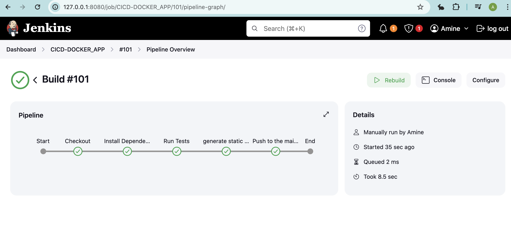

# CICD Docker App

This project demonstrates a full CI/CD pipeline that automatically tests, builds, and deploys a Python application using Jenkins and GitHub Actions. The pipeline performs the following steps:

1. **Checks for code pushed to the `master` branch**.
2. **Tests the code** using Jenkins.
3. **Pushes changes to the `main` branch** after tests pass.
4. **GitHub Actions** builds a Docker image, pushes it to Docker Hub, and deploys a static version of the website.

## Table of Contents
- [Project Overview](#project-overview)
- [Technologies Used](#technologies-used)
- [CI/CD Pipeline](#cicd-pipeline)
- [Jenkins Setup](#jenkins-setup)
- [GitHub Actions Workflow](#github-actions-workflow)
- [Docker Hub Integration](#docker-hub-integration)
- [Deployment](#deployment)
- [How to Run](#how-to-run)
- [Troubleshooting](#troubleshooting)

## Project Overview
This repository showcases an automated CI/CD pipeline using Jenkins and GitHub Actions. It involves testing code changes on Jenkins, pushing those changes back to the repository, building Docker images, pushing them to Docker Hub, and finally deploying the static assets of the website to GitHub Pages.




## Technologies Used
- **Jenkins**: For continuous integration and automated testing.
- **GitHub Actions**: For continuous delivery, building Docker images, and deployment.
- **Docker**: For containerizing the application.
- **Docker Hub**: For storing Docker images.
- **GitHub Pages**: For hosting the static version of the website.

## CI/CD Pipeline

### 1. **Code Pushed to Master Branch**
- The pipeline begins when new changes are pushed to the `master` branch of the repository.

### 2. **Automated Testing with Jenkins**
- Jenkins automatically triggers a build on every push to the `master` branch. It runs unit tests to verify the integrity of the code.
### 3. **Static Website Generation**:
   - The Flask application generates a static version of the website.
   - The static files are stored in the `static_site/` directory.
   
   To generate the static site, run the following command:

   ```bash
   python3 app/app.py
   ```

### 4. **Pushing to Main Branch**
- After successfully testing, Jenkins pushes the changes to the `main` branch.

### 5. **GitHub Actions: Build Docker Image and Deploy**
- GitHub Actions listens for any push to the `main` branch.
- It then builds a Docker image for the Python app and pushes it to Docker Hub.
- Finally, GitHub Actions deploys the static assets of the website to GitHub Pages.


## Jenkins Setup

- Configure Jenkins to automatically build and test the code when a new commit is pushed to the `master` branch.
- Relevant Jenkinsfile can be found in `./Jenkinsfile`.

## GitHub Actions Workflow

- The GitHub Actions workflow builds a Docker image, pushes it to Docker Hub, and deploys static assets to GitHub Pages.
- Workflow file path: `.github/workflows/docker-image.yml`

## Docker Hub Integration

- The project pushes Docker images to Docker Hub.
- Dockerfile path: `./app/Dockerfile`

## Deployment

- GitHub Actions deploys the static assets to GitHub Pages.
- The deployment configuration can be found in the GitHub Actions workflow file at `.github/workflows/docker-image.yml`.

## How to Run

1. Push your changes to the `master` branch.
2. Jenkins will run the automated tests.
3. If the tests pass, Jenkins pushes the changes to the `main` branch.
4. GitHub Actions will build a Docker image and push it to Docker Hub.
5. The static assets will be deployed to GitHub Pages.

## Troubleshooting

- Ensure Jenkins and GitHub Actions are properly configured with the right permissions.
- Verify Docker Hub credentials are set in the GitHub repository secrets.


## Links
[site generated](https://nuiled.github.io/CICD_App/)
[docker hub image](https://hub.docker.com/repository/docker/aoutifra/cicdapp/general)